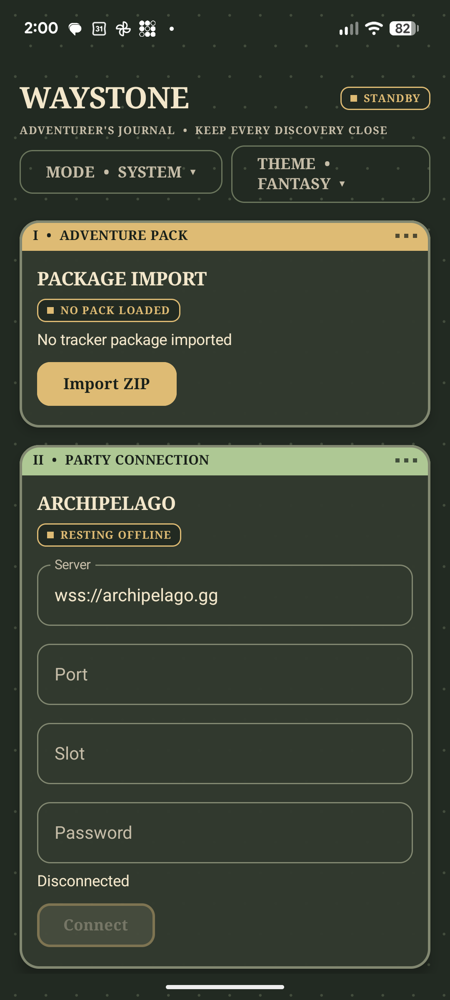
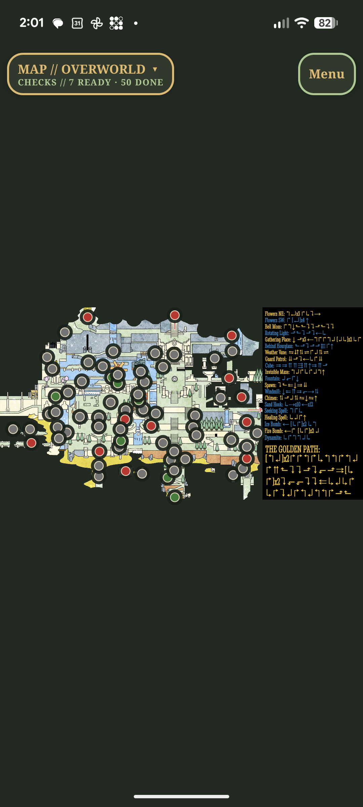
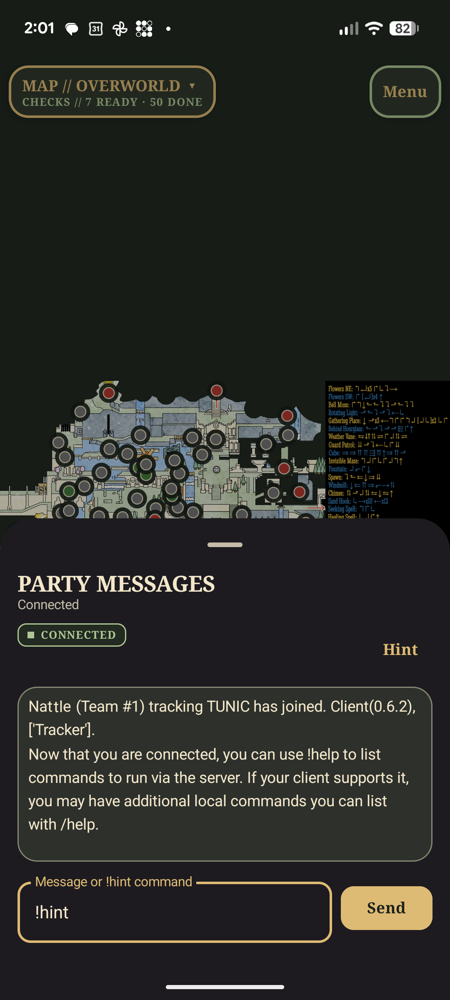
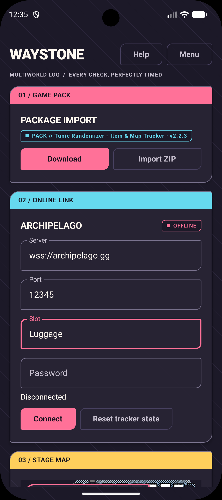

<p align="center">
  
</p>

<h1 align="center">Waystone</h1>

<p align="center">
  A tracker for keeping your Archipelago adventure close at hand.
</p>

Waystone is an Android companion for Archipelago players who would rather keep their tracker beside the game than behind another window. Import a compatible `PopTracker` pack, connect to your Archipelago room, and follow your maps, checks, items, and get `!hints`  from your phone.

It is a small, independent project built by one developer. 

### Links
`Discord` Check out the Waystone thread in community tools on the Archipelago server. 

#### Ethical AI disclosure:
```
The app concept, code architecture, and user experience design are entirely mine.
Art will be 100% human made.
AI is used to support integration and accelerate development.
```

## Closed Beta 
Temporary testing paths until the app is approved for the production release on the app stores. 

#### Android
1. Join https://groups.google.com/g/waystone-testing
2. Follow links to download from Google Play (may take a couple minutes to activate)

Alternately, you can install the latest release APK from this site. Its the same content. 

#### iOS
> **NOTE** The initial version is in review, until it's released by Apple the join link will not work. It will activate automatically once the version is approved. 
1. Install [Test Flight](https://apps.apple.com/us/app/testflight/id899247664) on your phone
2. https://testflight.apple.com/join/hW9BzJfB

## Want your pack listed?
Fill out this form and I'll see what I can do:
https://forms.gle/kNkeq6mDxD1khbyAA


## A look inside

<p align="center">
  
  
  
    
</p>

## Where things stand

Waystone is in active development, with Android making it's way to the public app store and iOS rolling out soon. It can load tracker ZIPs, connect directly to Archipelago (or a private server), and update the tracker from the room as you play. It uses PopTracker packs and has been tested with a small number of games.

### Features
- Uses PopTracker ZIP packages for maps and check information
  - Download from github directly in the app
- Connects to archipelago.gg or private servers
- Full Lua script support for pack logic
- Built in text client for hints
- Acquired items display
- Leaderboard of connected games (anonymous by game's pack name only)

This repository is the public home for the app, project information, and [issue tracking](https://github.com/Nattle/WaystoneApp/issues). 

Bug reports are especially helpful when they include:

- the game and tracker pack, with a link to the pack if possible
- what you expected and what happened instead
- If you think it's helpful, a screenshot or short set of steps that reproduces the problem

Pack support requests and small feature ideas are welcome too, but keep in mind it's just me

## Acknowledgements

Waystone builds on the work of the [Archipelago](https://archipelago.gg/) community and the [PopTracker](https://github.com/black-sliver/PopTracker) pack ecosystem. 
